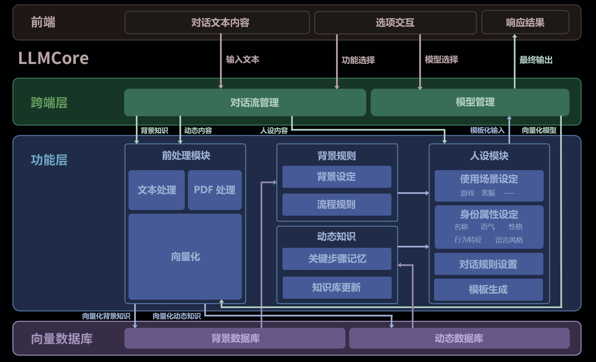

# LLMCore: 大语言模型框架

## 项目目标  

LLMCore 是一个旨在支持对话类游戏（如DND、狼人杀）的核心模块，基于大语言模型（LLM）提供自动化主持、动态知识管理和游戏互动功能。通过模块化设计，它可以灵活地扩展至不同类型的游戏场景，并确保模型适应各种设定。



---

## 1. 架构概览

### 1.1 跨端层 (managers)

负责与前端进行交互操作

- **模型管理：** 从前端获得输入请求，如模型类型，各类参数，然后返回输出；
- **对话流管理：** 负责 LangChain 层面的 Chain 的搭建，使 LLMCore 能衔接各种功能，如前处理，RAG, Template 等；

### 1.2 功能层（待实现）

该层负责文本预处理、背景规则管理和动态知识更新，包括：

- **前处理模块**：处理文本、PDF等输入数据，并将其向量化，以供模型调用。
- **背景规则模块**：负责设置和管理游戏背景规则，例如流程设定和场景切换。
- **动态知识模块**：通过动态更新知识库内容，记录玩家操作和重要的游戏事件。

### 1.3 向量数据库（待实现）

该层负责处理对向量数据库产生的各类请求

---

## 2. 代码模块介绍（未完成）

### `LLMCore.managers`

#### 模型加载器（model_loader）

```python
from LLMCore.managers.model_loader import ModelLoaderInterface

# 初始化接口并创建实例
model_loader_interface = ModelLoaderInterface(
    """
    - model_type: 模型调用类型，'local' 或 'api'。
    - inference_framework_type: 推理框架/供应商标识符。
        若模型为本地，则支持 'vllm'、'transformers' 等;
        若模型为 API 获得，则支持 'openai', 'qwen';
    """
    model_type=model_type,
    inference_framework_type=inference_framework_type
)

# 设置实例使用何种模型
model_loader_interface.set_llm_model_source(
    """
    - llm_model_source: 设置模型标识
      1. 本地调用使用路径，请指向LLMCore/pretrained/models/{llm_model_source}，如'Qwen2.5-7B-Instruct-AWQ'
      2. API 云端调用，给出供应商提供的模型标识，如'gpt-4o', 'qwen-max'
    """
    llm_source
)
# 设置实例使用何种模型
model_loader_interface.set_embedding_model_source(
    """
    - embedding_model_source: 设置模型标识
      1. 本地调用使用路径，请指向LLMCore/pretrained/embedding/{embedding_model_source}, 如'xiaobu-embedding-v2'
      2. API 云端调用，给出供应商提供的模型标识，如'text-embedding-ada-002', 'text-embedding-v3'
    """
    embedding_source
)

# 根据不同的推理后端，设置加载 llm 模型的参数
model_loader_interface.load_llm(**kwargs)
# 获得可以接入 LangChain 的 llm 对象
llm = model_loader_interface.get_llm()

# 根据不同的推理后端，设置加载 embedding 模型的参数
model_loader_interface.load_embeddings(**kwargs)
# 获得可以接入 LangChain 的 embedding 对象
embeddings = model_loader_interface.get_embeddings()

```

**支持调用本地模型**

- 目前支持 Hugging face Transformers 库作为推理后端，支持 CUDA/CPU/MPS 推理；

- 目前支持 vLLM 作为推理后端，以 Docker 服务器的形式运行于本地：

  - 暂支持兼容 OpenAI SDK API 的模型调用方式；
  
  - 暂支持 CUDA/CPU 进行推理；

**支持使用 API Key 调用云端模型**

- 目前支持 DashScope Key 调用 Qwen 云端大模型，需要自行提供 Key

- 目前支持 OpenAI Key 调用 GPT 等 云端大模型，需要自行提供 Key


---

## 项目结构树（未完成）

```
MimirFW/
├── LLMCore/
│   ├── managers/
│   │   ├── inference_framework.py          # 推理后端接口统一封装
│   │   ├── model_loader.py                 # 模型加载接口统一封装
│   │
│   ├── utils/
│   │   ├── model_selector.py               # 供前端接口使用，枚举可使用模型
│   │
│   ├── pretrained/
│   │   ├── embedding                       # 向量化用的嵌入模型存放位置
│   │   ├── models                          # 对话大模型存放位置
│   │   └── downloader.py                   # 自实现的模型下载器，使用 ModelScope 源
│   │
│   ├── demo.py                             # 简易的运行测试
│   └── README.md
│
└── Docker/
    ├── LLMCore                             # 项目的 Docker 配置
    ├── ……                                  # 其他项目的 Docker 配置
    └── docker-compose.yml                  # Docker Compose 配置文件
```

---
