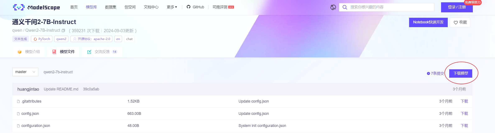
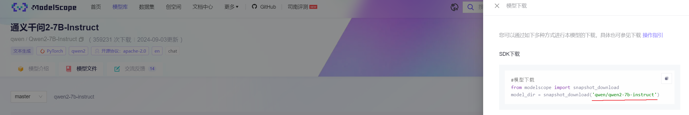

## Model Downloader

`Model Downloader` 是一个用于从 [ModelScope](https://modelscope.cn) 下载指定模型和 embedding 的轻量级 Python 工具。通过前端传入的 ModelScope ID，后端将模型或 embedding 下载到指定目录，方便模型管理与存储。

### 功能介绍

- **模型下载**：根据传入的 `model_id` 从 ModelScope 下载指定的模型。如果模型已经存在，则跳过下载。
- **embedding 下载**：如果传入了 `embedding_id`，则根据该 ID 从 ModelScope 下载 embedding。如果 embedding 已存在，也会跳过下载。
- **文件存储**：所有下载的模型存储在 `models` 目录下，所有下载的 embedding 存储在 `embedding` 目录下。

### ModelScope 模型ID 获取




### 目录结构

模型和 embedding 的下载目录结构如下：

```
├── models
│   ├── Qwen2-1.5B-Instruct-AWQ     # 根据 ModelScope ID 下载的模型
│   │   └── [模型文件内容]
│   └── Llama3.1-70B-Instruct       # 另一个下载的模型
│       └── [模型文件内容]
├── embedding
│   ├── xiaobu-embedding-v2         # 根据 ModelScope ID 下载的 embedding
│   │   └── [embedding 文件内容]
│   └── conan-embedding-v1          # 另一个下载的 embedding
│       └── [embedding 文件内容]
└── downloader.py                   # 下载器脚本
```

### 使用方法

#### 下载 模型 和 embedding

后端通过接收前端传入的 `model_id` 和 `embedding_id`，可以同时下载模型和 embedding。

**示例**：

```python
# 示例用法
if __name__ == "__main__":
    # 模拟前端传入的预设字典
    model_dict = {
        "Qwen2-1.5B-Instruct": "qwen/qwen2-1.5b-instruct",
        "Qwen2-1.5B-Instruct-AWQ": "qwen/Qwen2-1.5B-Instruct-AWQ",
        "Qwen2-7B-Instruct": "qwen/qwen2-7b-instruct",
        "Qwen2-7B-Instruct-AWQ": "qwen/Qwen2-7B-Instruct-AWQ",
        "Qwen2-72B-Instruct": "qwen/qwen2-72b-instruct",
        "Qwen2-72B-Instruct-AWQ": "qwen/Qwen2-72B-Instruct-AWQ",
        "Llama3.1-8B-Instruct": "LLM-Research/Meta-Llama-3.1-8B-Instruct",
        "Llama3.1-70B-Instruct": "LLM-Research/Meta-Llama-3.1-70B-Instruct"
    }

    embedding_dict = {
        "xiaobu-embedding-v2": "Tolk8888/xiaobu-embedding-v2",
        "conan-embedding-v1": "KeplerAI/conan-embedding-v1-onnx",
        "zpoint_large_embedding_zh": "maple77/zpoint_large_embedding_zh"
    }

    # 假设前端传入了模型和 embedding 的 key
    model_key = "Qwen2-1.5B-Instruct-AWQ"
    embedding_key = "xiaobu-embedding-v2"

    # 获取对应的 ModelScope ID
    model_id = model_dict.get(model_key)
    embedding_id = embedding_dict.get(embedding_key)

    # 创建下载器实例
    downloader = ModelDownloader()

    # 下载模型和 embedding
    result = downloader.download_model(model_id, embedding_id)
    print(result)
```

### 依赖

`modelscope`: 使用 ModelScope 提供的 Python SDK 下载模型。

安装依赖：

```bash
pip install modelscope
```