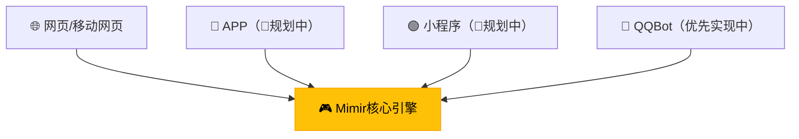

# MimirFrameWork


本项目旨在开发一个基于大语言模型（LLM）的对话游戏搭建框架，支持类似DND（龙与地下城）、狼人杀、文游等对话类游戏的快速设计和智能化NPC构建，增强对话类游戏的大模型响应体验。

~~幻想朋友发生器，任何需要凑人头玩的含语言的游戏都可以用这个搭建，社恐的福音布道，赛博时代的桌游店，合成人格矩阵的第一步~~

> "如同乐高积木般的智能体NPC对话类游戏构建体验 - 开发者提供基础模块，用户自由拼装游戏"

## 🧰 搭建对话类游戏的大模型解决方案

- 我们希望能借助LLM、RAG等技术，定制能增强对话类游戏体验的大模型响应功能，例如人物预设，世界背景设定，进度回溯，乃至游戏插图生成等；
- 我们希望能以低代码的形式，助力用户搭建一个自己的对话类游戏，尤其是类似于DND，文游等需要大量设定、判定以及交互代入感的游戏；
- 我们希望它部署简单，二次开发轻松，多平台适配；

## 🌐 全平台前端支持方案（规划）



## 👥 多用户身份支持

### 游戏服务供应商

- **身份定位：**
    - 您是提供对话类游戏托管服务的平台运营商
    - 您的目的包括但不限于：
        - 希望提供特征/优化的私有大模型；
        - 希望提供特定对话类游戏服务；
        - 希望推广某些大模型云服务API的使用；
- **适用场景**：

    ```mermaid
        graph TD
            classDef purpose fill:#4CAF50,stroke:#388E3C,color:white,stroke-width:2px
            classDef condition fill:#FFC107,stroke:#FFA000,color:black,stroke-width:2px
            classDef solution fill:#2196F3,stroke:#1976D2,color:white,stroke-width:2px

                P1["🔧 提供特制/优化的大模型"]:::purpose
                P2["🎮 提供特定游戏服务"]:::purpose
                P3["☁️ 大模型云服务代理"]:::purpose
        
                C1["🏭 拥有GPU计算集群"]:::condition
                C2["🖥️ 无集群部署能力"]:::condition
        
                S1["🚀 云原生高性能部署方案
                - K8s集群管理
                - vLLM推理优化
                - 自动扩缩容"]:::solution
                S2["🌐 大模型API调用方案
                - 多厂商API聚合
                - 智能路由
                - 用量监控"]:::solution
        
                P1 --> C1
                P1 --> C2
                P2 --> C1
                P2 --> C2
                P3 --> C2
                C1 --> S1
                C2 --> S2
    ```

- **适配优势**：
    - 多场景适配的部署模式（本地推理 / 云API）
    - 高性能的云原生集群推理的方案（K8s+vLLM）
    - 支持 RAG 管理私有知识库，赋能游戏特色；
    - 部署十分简易快速（Helm一键启用）
    - 预设多套游戏模板和前端皮肤模板（🚧规划中）
    - 二次开发便利，代码模块化便于接入，文档详细，支持插件注册（🚧规划中）；

### 游戏创作者/主机

- **身份定位：**
    - 您是一个对话类游戏爱好者，有意自行定制该类游戏
    - 您希望作为主机，使用现成/轻松自制的对话类游戏，和朋友组局
- **适用场景**：
    
    ```mermaid
        graph TD
        classDef purpose fill:#4CAF50,stroke:#388E3C,color:white,stroke-width:2px
        classDef condition fill:#FFC107,stroke:#FFA000,color:black,stroke-width:2px
        classDef solution fill:#2196F3,stroke:#1976D2,color:white,stroke-width:2px
        classDef official fill:#9C27B0,stroke:#6A1B9A,color:white,stroke-width:2px 
            
                    P1["🎨 低代码游戏设计"]:::purpose
                P2["🚪 零运维联机开服"]:::purpose
                P3["🧩 生态扩展能力"]:::purpose
        
                C1["💻 本地GPU可用"]:::condition
                C2["☁️ 纯云端开发"]:::condition
                C3["🔌 网络访问方案"]:::condition
                C4["👶 技术新手友好"]:::condition
                C5["🏢 官方托管支持"]:::condition
        
                S1["📦 单卡Docker方案
                - 一键启动脚本
                - 资源占用监控
                - 自动模型下载"]:::solution
                S2["🌩️ 免配置API方案
                - 多平台密钥管理
                - 用量成本看板
                - 自动降级策略"]:::solution
                S3["🔧 插件生态
                - 安全沙箱机制
                - 热更新支持
                - 社区排行榜"]:::solution
                S4["🛡️ 极简联机方案
                - 内网穿透教程
                - QQ群Bot集成
                - 社交平台适配"]:::solution
                S5["✨ 低代码工具链
                - 剧情流程图工具
                - 角色卡生成器
                - 测试沙盒环境"]:::solution
                S6["🏛️ 官方公共平台
                - 托管型开发环境
                - 跨平台联机服务
                - 游戏分享平台
                - 官方插件市场
                - 统一账户体系"]:::official
        
                P1 --> C4
                P2 --> C1 & C2 & C3 & C5
                P3 --> C4
                C1 --> S1
                C2 --> S2
                C3 --> S4
                C4 --> S3 & S5
                C5 --> S6
    ```
    
- **适配优势**：
    - **低代码设计游戏**：通过可视化界面拖拽功能模块
    - **一键部署**：选择云服务商（推荐）或本地设备启动实例
    - **邀请玩家**：轻松生成专属游戏链接或接入社交平台（QQBot）
    
    > **PS，官方托管支持目前待定，因为个人维护公共服务器的成本还是过高，只能等有钱了再用爱发电了…**

### 游戏玩家

- **身份定位：**
    - 您只是想加入一场对话类游戏
- **适配优势**：
    - 丰富的跨平台体验，提供朋友链接/社交平台，轻松加入游戏；
    - 享受大模型赋能的新型对话类游戏体验；
    - 提供官方（待定）/第三方托管网站，通过代码检索到托管的游戏房间；

## 🚀 快速开始

```bash
# 单节点 Docker 启动（单卡/自用设备，支持小参数模型 or API调用）
pass
# GPU集群 Helm 启动（GPU集群，推理大模型并提供服务）
pass
```

## 📜 开源协议

采用 **AGPLv3** 协议，保障：

- 云服务商必须开源修改后的服务端代码，但依旧可以通过以下方式盈利：
    - 提供托管运维服务
    - 大模型API计费
    - 模型商店和托管服务
    - 开发增值闭源插件（需接口隔离）
- 允许私有化部署和商业使用
- 插件系统兼容MIT协议
---

[贡献指南](https://www.mimirfw.chat/) | [开发者文档](https://docs.mimirfw.chat/) | [在线体验](https://demo.mimirfw.chat/)
